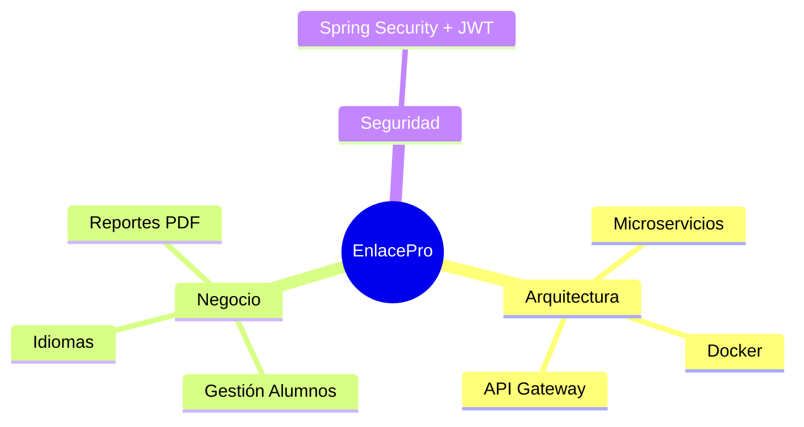

#  ENLACE PRO
> **Plataforma de adaptación lingüística para Aulas de Enlace (Secundaria).**

 
 

---

## 📝 Introducción
**Enlace Pro** es una plicación diseñada para facilitar el trabajo del profesorado y el aprendizaje del alumnado en las **Aulas de Enlace de Secundaria**. 

La arquitectura ha evolucionado de un monolito modular a un sistema de Microservicios desarrollado en 

Aplicando:
* **Backend:** Construido con **Spring Boot**.
* **Arquitectura:** Implementación de **Patrón Hexagonal** (Puertos y Adaptadores).
* **Metodología:** Desarrollo mediante **Vertical Slicing**, garantizando funcionalidades completas e independientes.

---

## 👥 Equipo del Proyecto

<table style="border: none;">
  <tr>
    <td align="center" width="200">
       
      <b>Hanane </b> 
      HananeHB
    </td>
    <td align="center" width="200">
        
         
        <b>Jennifer</b> 
        JennyCS48
    </td>
    <td align="center" width="200">
      
      <b>Nuhaila</b> 
      nuasai04
    </td>
    
  </tr>
</table>

**Última actualización:** Febrero 2026 

---

## 🗺️ Índice de Documentación
> Toda la documentación está organizada por ficheros aparte para facilitar su consulta.

### 1. Contexto y Requisitos Funcionales
| Sección | Contenido |
| :--- | :--- |
| **Contexto de la aplicación** | [Mundo real del problema](/doc/contexto/problema_real.md) • [Qué apps existen](/doc/contexto/apps_existentes.md) • [Cómo la mía es mucho mejor porque hace...](/doc/contexto/propuesta_valor.md) |
| **Funcionalidad** | [Casos de Uso (Actores)](/doc/requisitos/casos_de_uso.md) |
| **Especificaciones** | [Requisitos Funcionales](/doc/requisitos/requisitos_funcionales.md) • [Requisitos No Funcionales](/doc/requisitos/requisitos_no_funcionales.md) |
| **Seguridad** | [Control de Acceso y Seguridad](/doc/seguridad_control_de_acceso.md) |

### 2. Arquitectura y Datos 🏗️
Para una visión técnica profunda, consulta los diagramas y el diseño de datos:

* **Evolución:** [De monolito a microservicios](/doc/arquitectura/microservicios.md).
* **Contenedores:** [Docker](/doc/arquitectura/docker.md).
* **Persistencia:** [Migración a BBDD externa](/doc/arquitectura/base_de_datos/base_datos_externa.md) • [Esquema de Base de Datos](/doc/arquitectura/base_de_datos/base_de_datos.md)
* **Configuración por entornos:** [Gestión de perfiles](/doc/arquitectura/perfiles.md).
* **Modelo C4:** [Diagramas de Contexto y Contenedores](/doc/arquitectura/modelo_c4.md).
* **Infraestructura:** [Plan de Despliegue](/doc/arquitectura/despliegue.md) •  [Componentes del sistema](/doc/arquitectura/componentes.md).
* **API:** [Diseño de Servicios REST](/doc/arquitectura/servicios_rest/rest.md).

### 3. Seguridad y API

* **Autenticación y Autorización:** [Spring Security + JWT](/doc/seguridad/auth.md).
* **Documentación Técnica:** [Swagger & OpenAPI](/doc/documentacion_api/swagger.md).

### 4. Frontend Y Experiencia de Usuario

* **Motor de vistas:** [Thymeleaf y fragmentos](/doc/front/thymeleaf.md).
* **Diseño Visual:** [Tailwind CSS](/doc/front/tailwind.md).
* **Adaptación lingüística:** [Internacionalización (i18n)](/doc/front/i18n.md).
* **Generación de Reportes:** [Exportación dinámica a PDF](/doc/front/pdf.md).

### 5. Referencias y Apoyo 📚
* 📖 [Manual de Usuario](/doc/referencias/manual_usuario/manual_usuario.md)
* 🏁 [Conclusiones Individuales](/doc/referencias/conclusiones.md)
* 🖇️ [Bibliografía](/doc/referencias/bibliografia.md)
* 🔗 [Anexos](/doc/referencias/anexos/anexos.md)

---

## 🛠️ Tecnologías Utilizadas
| Categoría | Herramientas |
| :--- | :--- |
| **Lenguaje** | |
| **Framework** |   |
| **Arquitectura** | |
| **Gestión de dependencias** |  !|
| **Seguridad** |  |
| **Base de Datos** |  |
| **Persistencia** |   |
| **Documentación** ||
| **Contenedorización** |  |
| **Motor de Vistas** |  |
| **Estilos** |  |
| **Internacionalización** |  |

---

## Resumen visual

   
  <b>Enlace Pro 2026</b> •Desarrollado con ❤️ para la educación secundaria. 
  

