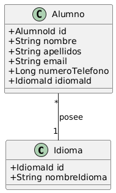

## 1. Tecnología y Contexto

|**Aspecto**|**Descripción**|
|---|---|
|**Motor de Base de Datos**|**H2 Database** (Modo Embebido). Utilizado para proporcionar una base de datos **ligera y en memoria** durante el desarrollo y las pruebas, lo que permite un arranque rápido y un entorno autocontenido (sin necesidad de configurar un servidor DB externo).|
|**Tecnología de Persistencia**|**Spring Data JPA**. Permite mapear las clases Java (Entidades) a las tablas de la base de datos (H2) y simplifica drásticamente la implementación de las operaciones CRUD gracias a los repositorios.|
|**Objetivo**|Almacenar información de alumnos (`ALUMNOS`) y sus referencias a idiomas nativos (`IDIOMAS`), manteniendo un modelo relacional estricto.|

## 2. Diagrama Entidad-Relación 

El modelo se compone de dos entidades principales relacionadas:

- **ALUMNOS:** Entidad principal que almacena los datos personales.
    
- **IDIOMAS:** Entidad de apoyo que permite categorizar el idioma nativo de los alumnos.
    

Se establece una relación **One to Many (1:N)**: Un `Idioma` puede ser el nativo de muchos `Alumnos`, pero cada `Alumno` tiene un solo `Idioma Nativo`.

## 3. Esquema de Tablas (Detalle Mapeado)

La definición de las entidades se traduce directamente en las tablas SQL gestionadas por H2 a través de Hibernate (el proveedor de JPA).

### 3.1. Tabla: `ALUMNOS` (Mapeada a la clase `Alumno`)

| **Campo (Columna)** | **Tipo de Dato (SQL)** | **Restricción**                   | **Mapeo JPA**            | **Descripción**       |
| ------------------- | ---------------------- | --------------------------------- | ------------------------ | --------------------- |
| `id`                | `BIGINT`               | **PK**, Auto Incrementable        | `@Id`, `@GeneratedValue` | Identificador único.  |
| `nombre`            | `VARCHAR`              | NOT NULL                          |                          | Nombre de pila.       |
| `apellidos`         | `VARCHAR`              | NOT NULL                          |                          | Apellidos del alumno. |
| `email`             | `VARCHAR`              | NOT NULL, **UNIQUE**              |                          | Correo electrónico.   |
| `numero_telefono`   | `BIGINT`               | NOT NULL                          |                          | Número de contacto.   |
| `idioma_id`         | `BIGINT`               | **FK** Referencia a `IDIOMAS(id)` | `@ManyToOne`             | ID del idioma nativo. |

### 3.2. Tabla: `IDIOMAS` (Mapeada a la clase `Idioma`)

|**Campo (Columna)**|**Tipo de Dato (SQL)**|**Restricción**|**Mapeo JPA**|**Descripción**|
|---|---|---|---|---|
|`id`|`BIGINT`|**PK**, Auto Incrementable|`@Id`, `@GeneratedValue`|Identificador único del idioma.|
|`nombre_idioma`|`VARCHAR`|NOT NULL, UNIQUE||Nombre del idioma (ej: "Español").|

## 4. Uso y Ventajas de H2 

- **Desarrollo Ágil:** H2 nos permite concentrarnos en la lógica de negocio sin dedicar tiempo a la administración de bases de datos externas.
    
- **Pruebas (Testing):** H2 es ideal para **pruebas unitarias y de integración**, ya que el entorno de pruebas puede crearse y destruirse rápidamente con datos limpios en cada ejecución.