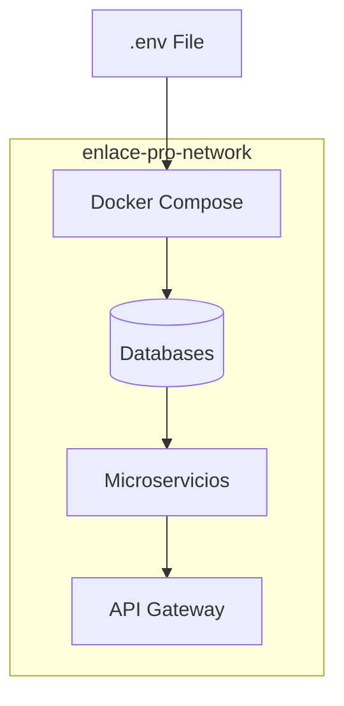

# 🐳 Infraestructura y Contenedores: Docker


  

El despliegue de **Enlace Pro** se basa en la tecnología de contenedores **Docker**. Esto nos permite empaquetar cada microservicio con todas sus dependencias (JVM, librerías, configuración), garantizando que la aplicación funcione exactamente igual en cualquier entorno.

<p align="start" style="margin-top: 30px; margin-bottom: 30px;"> ◆ ◆ ◆ </p>

## 1. Estrategia de Contenedores

Hemos adoptado una arquitectura multi-contenedor donde cada pieza del sistema está aislada y cumple una función específica:

| Componente | Función Principal |
| :--- | :--- |
| **API Gateway** | Punto de entrada único encargado del enrutamiento de tráfico. |
| **Auth Service** | Gestión de identidad, autenticación y seguridad JWT. |
| **Alumnos Service** | Núcleo de la lógica de negocio y gestión académica. |
| **Bases de Datos** | Instancias independientes de **MySQL** y **MariaDB**. |
| **Adminer** | Interfaz gráfica para la gestión visual de los datos. |

<p align="start" style="margin-top: 30px; margin-bottom: 30px;"> ◆ ◆ ◆ </p>


## 2. Orquestación con Docker Compose

Para gestionar el ciclo de vida de todos estos servicios simultáneamente, utilizamos **Docker Compose**. Esto nos permite definir toda la infraestructura en un único archivo YAML, automatizando:

1.  **Redes Virtuales**: Creación de una red interna (`enlace-pro-network`) donde los microservicios se comunican de forma segura sin exponer todos sus puertos al exterior.
2.  **Volúmenes**: Persistencia de datos para que la información de MySQL y MariaDB no se pierda al detener los contenedores.
3.  **Variables de Entorno**: Inyección de configuraciones sensibles y URLs a través de un archivo `.env`.

### Flujo de Orquestación


<p align="start" style="margin-top: 30px; margin-bottom: 30px;"> ◆ ◆ ◆ </p>


## 3. Optimización de Imágenes

Cada microservicio cuenta con su propio **`Dockerfile`**. Hemos seguido buenas prácticas para asegurar imágenes ligeras y eficientes:

* **Imágenes Base**: Uso de `eclipse-temurin` (distribución de OpenJDK) para asegurar compatibilidad con Java 17/21.
* **Gestión de Memoria**: Configuración de variables de entorno como `JAVA_TOOL_OPTIONS` para limitar el uso de RAM de cada contenedor, optimizando el rendimiento global del sistema.

```Dockerfile
# Ejemplo de estructura base utilizada
FROM eclipse-temurin:21-jdk-alpine
WORKDIR /app
COPY target/*.jar app.jar
EXPOSE 8081
ENTRYPOINT ["java", "-jar", "app.jar"]
```
<p align="start" style="margin-top: 30px; margin-bottom: 30px;"> ◆ ◆ ◆ </p>


## 4. Gestión de Dependencias (Healthchecks)

Para evitar errores de conexión (`Connection Refused`) al arrancar el sistema, hemos implementado el control de dependencias en el `docker-compose.yml`:

- El **Gateway** y los **Microservicios** esperan a que las bases de datos estén listas (`healthy`) antes de intentar iniciar su propia ejecución.
- Esto asegura un orden de arranque lógico: **`Base de Datos` -> `Microservicios` -> `API Gateway`**.

<p align="start" style="margin-top: 30px; margin-bottom: 30px;"> ◆ ◆ ◆ </p>


## 5. Ventajas de esta Infraestructura

| Beneficio | Descripción |
| :--- | :--- |
| **Portabilidad** | El proyecto se levanta en cualquier máquina con un solo comando: `docker-compose up`. |
| **Aislamiento** | Si una base de datos falla, no afecta a la ejecución del otro microservicio. |
| **Escalabilidad** | Permite levantar múltiples instancias de un servicio si la carga de alumnos aumenta. |

