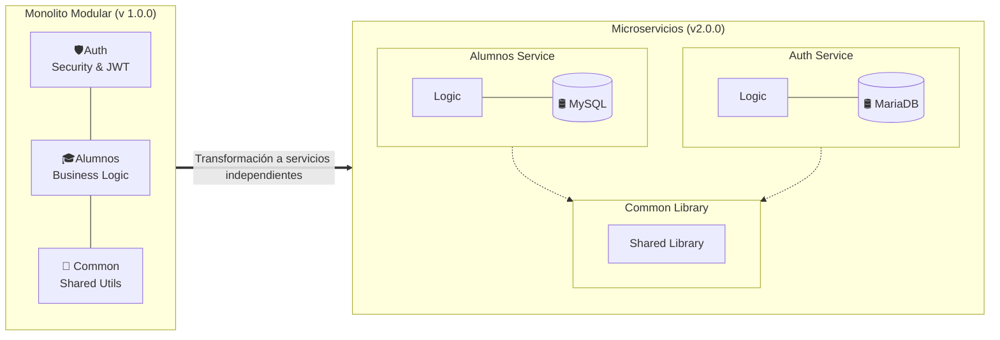
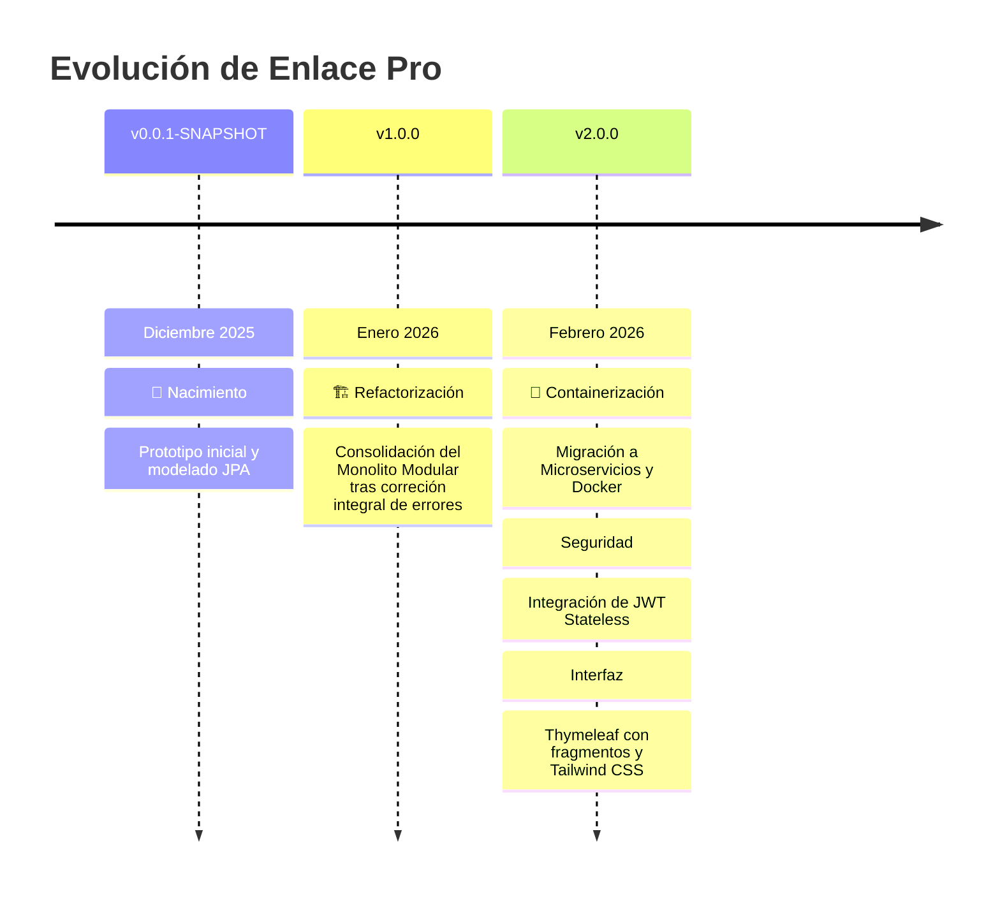

# Registro de Control de Versiones

  
  


> **Historial detallado de la evolución técnica y funcional de Enlace Pro.**


##  Versión 2.0.0 (Actual)
**Estado:** `ESTABLE` | **Fecha:** Febrero 2026

En esta versión hemos dado el salto definitivo hacia la escalabilidad, transformando la estructura base en un sistema robusto y preparado para el entorno real.

###  Mejoras y Correcciones
#### CAMBIOS DE INFRAESTRUCTURA
```diff
+ Arquitectura: Migración integral de Monolito a Microservicios.
+ Seguridad: Autenticación Stateless mediante Spring Security y JWT.
+ Datos: Persistencia real en contenedores MySQL/MariaDB con volúmenes.
+ Orquestación: Despliegue unificado mediante Docker Compose.
```




#### CAMBIOS DE INTERFAZ
```diff
+ UI: Rediseño modular con Tailwind CSS.
+ UX: Implementación de Temas (Dark/Light mode).
+ i18n: Adaptación lingüística dinámica para entornos educativos.
+ Reportes: Motor de exportación de listados a formato PDF.
```


<p align="start" style="margin-top: 30px; margin-bottom: 30px;"> ◆ ◆ ◆ </p>


##  Versión 1.0.0
**Estado:** `FINALIZADA` | **Fecha:** Enero 2026

Salto de la fase SNAPSHOT a versión 1.0.0 tras correción integral de errores.

<p align="start" style="margin-top: 30px; margin-bottom: 30px;"> ◆ ◆ ◆ </p>


##  Versión 0.0.1-SNAPSHOT
**Estado:** `ARCHIVADA` | **Fecha:** Diciembre 2025

#### VERSIÓN INICIAL DE PROYECTO

* **Infraestructura:** Creación del proyecto con **Spring Boot** y **Maven**.
* **Modelado:** Definición del esquema inicial de base de datos y entidades JPA.
* **Base:** Implementación de las primeras APIs de gestión 

```diff
+ Infraestructura: Creación del proyecto con Spring Boot y Maven.
+ Modelado: Definición del esquema inicial de base de datos y entidades JPA.
+ Base: Implementación de las primeras APIs de gestión 
```


## ⏳ Línea de Tiempo del Desarrollo




